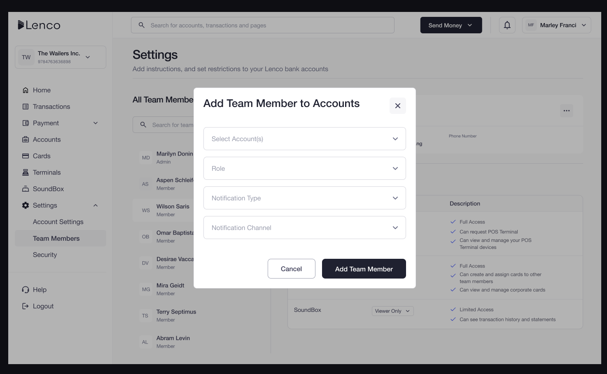
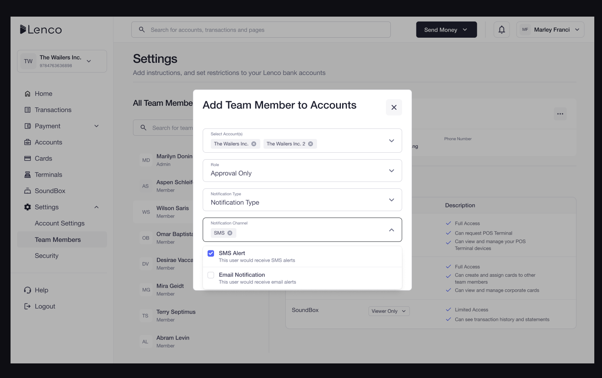

# How can I add a team member to a Sub-Account?

Collection: Team Access

Original article: [view source](https://support.lenco.co/en/articles/11569974-how-can-i-add-a-team-member-to-a-sub-account)

To add a team member to a sub-account, follow the steps below:

- Click on **SETTINGS**on the home page.
- Click on **TEAM MEMBERS.**
- Click on the team member to be added.
- Click on the **three dots**.
- Then, click **ADD** to any of the sub-accounts.

