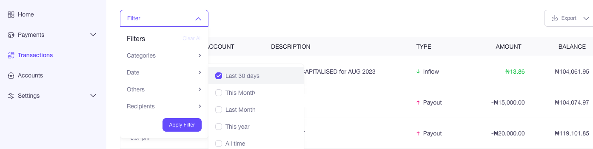

# How do I generate a monthly account statement?

Collection: General

Original article: [view source](https://support.lenco.co/en/articles/6000366-how-do-i-generate-a-monthly-account-statement)

To generate an account statement, follow the steps below;

​
​**Option 1:**

Send an email with a request to
[support@lenco.co](mailto:support@lenco.co)

For Zambian Merchants, kindly send an email with a request to
[support.zm@lenco.co](mailto:support.zm@lenco.co)
​
​**Option 2:**

- Click on **TRANSACTIONS** on the homepage
- Filter by **DATES**, **CATEGORIES**, **RECIPIENTS** or **OTHERS**
- Click on **APPLY FILTER**
- Click on **EXPORT** (PDF or CSV) to download the statement.

