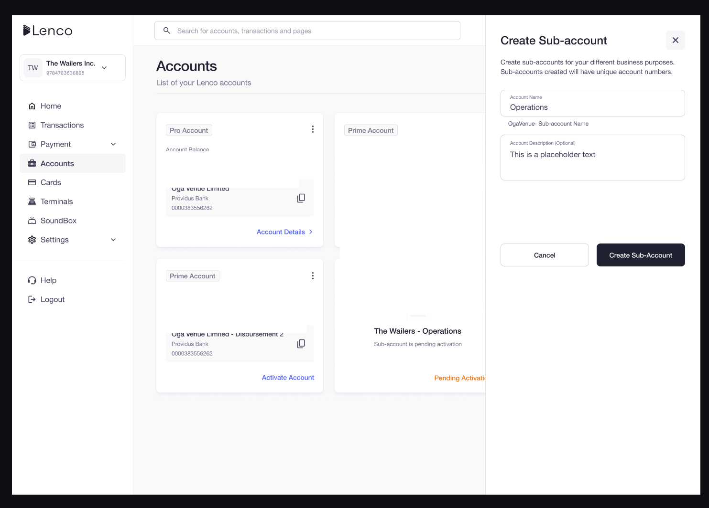

# How can I create a sub-account?

Collection: General

Original article: [view source](https://support.lenco.co/en/articles/6000436-how-can-i-create-a-sub-account)

To create a Sub-account, follow the steps below:

1. Click on **ACCOUNTS** on the left side menu of your page.
2. Click on **‘Add Account’** to CREATE Sub-Account**.**
3. Give your sub-account a name, e.g. expenses, operations, commissions, etc.
4. Describe what you want to use the sub-accounts for, e.g. used for commission collections.
5. Click **Create Sub-Accounts**.

