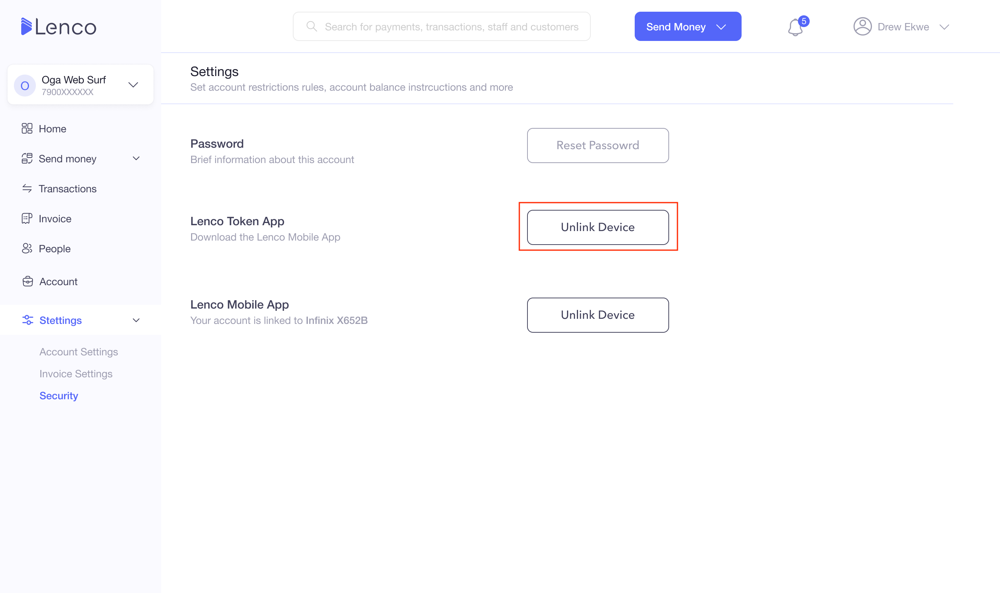

# How can I unlink my Token app with my account?

Collection: Security & Privacy

Original article: [view source](https://support.lenco.co/en/articles/6000574-how-can-i-unlink-my-token-app-with-my-account)

To unlink your token app from your account, follow the steps
below;

1. Login to the App

- Click on **More**
- Clcik on **Profile**
- Click on **Security Centre**
- Then, click on **Token Ap**p
- Click on**Unlink Token App**

2. Log in to the web

- Click on **SETTINGS** on the homepage
- Click on **SECURITY**
- Click on **UNLINK TOKEN APP**

Where you cannot access your account, you can contact
[support@lenco.co](mailto:support@lenco.co)
to help you unlink the Token app.

See below for a breakdown of how to unlink your token app from
your account:

