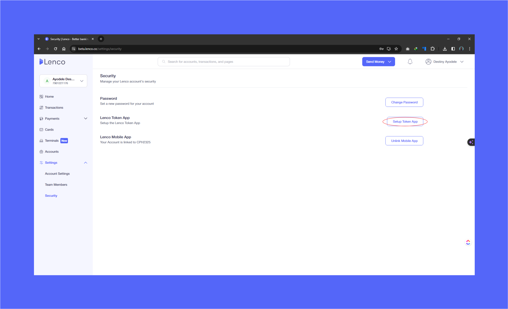

# How can I link my Token app with my account?

Collection: Security & Privacy

Original article: [view source](https://support.lenco.co/en/articles/6000633-how-can-i-link-my-token-app-with-my-account)

The token app is very essential because it helps a customer have
quick access to token, for them to sign into their account with
ease and on the go without having to check their mail.

To link your token app with your account, follow the steps below;

1. Login to the App

- Click on **More**
- Click on **Profile**
- Click on **Security Centre**
- Then, click on **Token App**
- Click on **Setup Token App**

2. Login to the Web

- Click on **SETTINGS** on the homepage
- Click on **SECURITY**
- Click on **SETUP TOKEN APP**

See below for a breakdown of how to link your token app with your
account:

