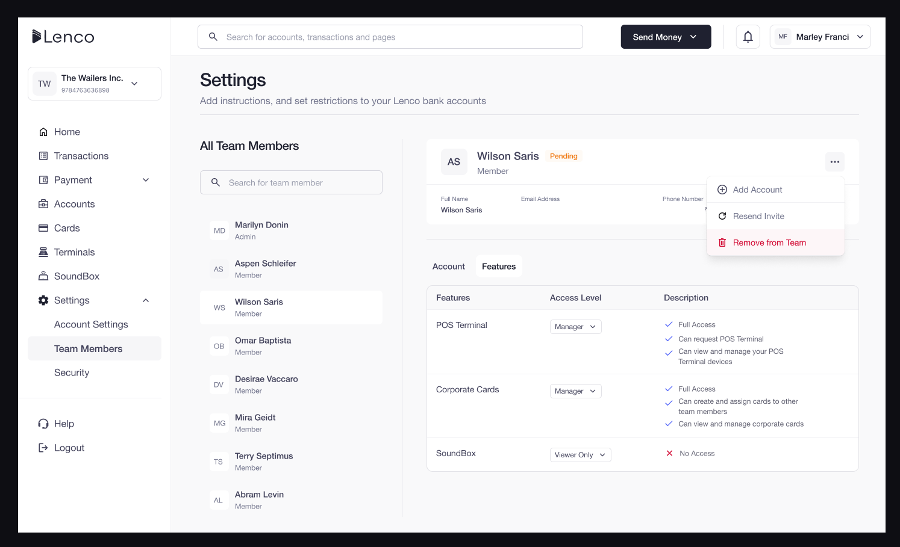
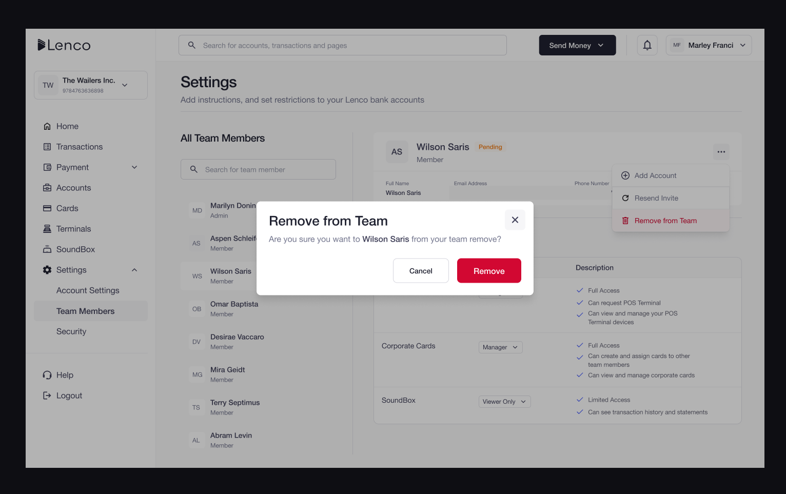

# How can I remove a team member?

Collection: Team Access

Original article: [view source](https://support.lenco.co/en/articles/6000643-how-can-i-remove-a-team-member)

To remove a team member, follow the steps below;

- Click on **SETTINGS** on the home page
- Click on **TEAM MEMBERS**
- Click on the team member to be removed and an icon will pop up
- Click on **REMOVE FROM TEAM**

