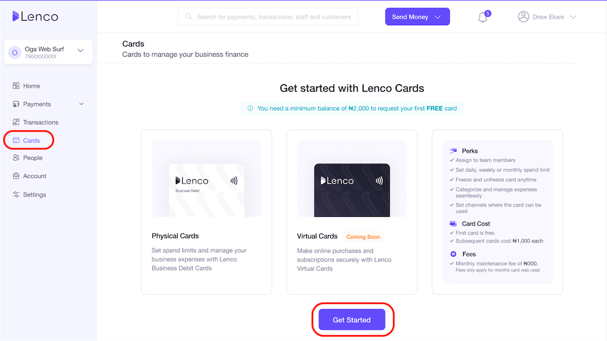
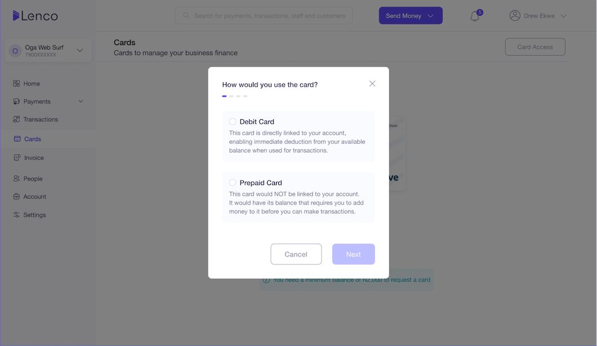
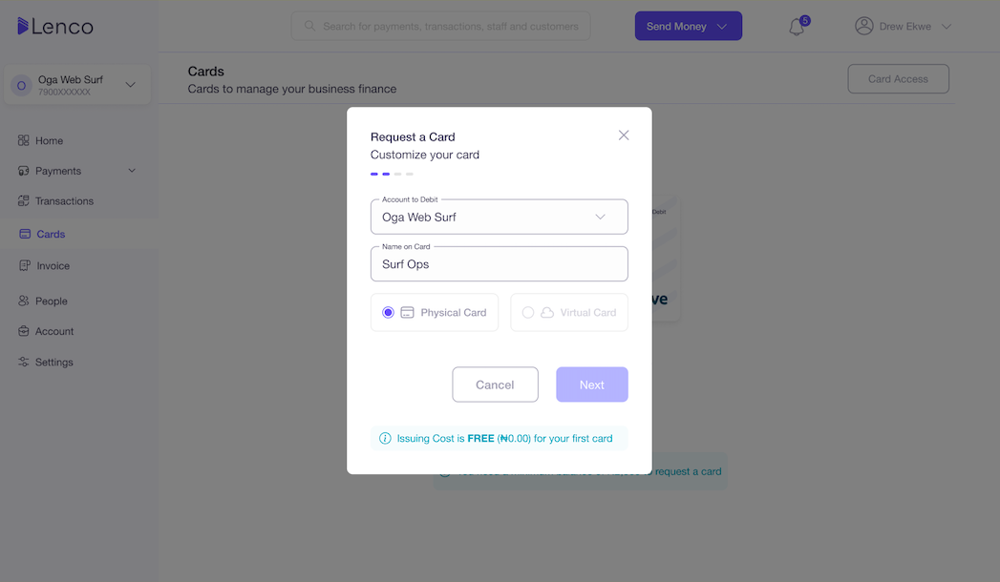
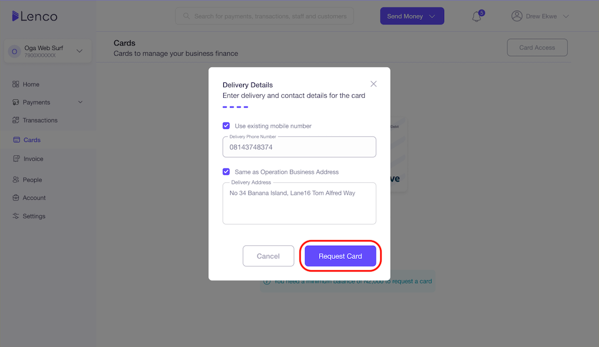
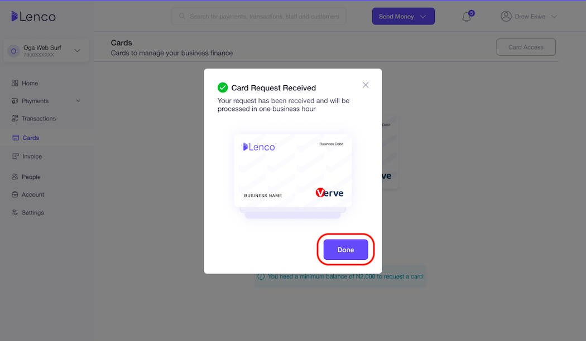

# How do I request a Lenco Card?

Collection: Lenco Cards

Original article: [view source](https://support.lenco.co/en/articles/6231654-how-do-i-request-a-lenco-card)

To request a Lenco card:

- Kindly login to the Lenco dashboard.
- Click on **Cards**.
- Then, click on ‘Request Card'.
- Select 'Card type’ and proceed with your request.

For bulk requests (requests for more than five cards), you can
send an email to
[cardservices@lenco.co](mailto:cardservices@lenco.co)
with the details below for each card:

| SN  | Name on card | Lenco Account No. | Card type (Direct Debit or Prepaid) | Delivery Address | Delivery Phone Number |
| --- | ------------ | ----------------- | ----------------------------------- | ---------------- | --------------------- |
| 1   |              |                   |                                     |                  |                       |
| 2   |              |                   |                                     |                  |                       |
| 3   |              |                   |                                     |                  |                       |
| 4   |              |                   |                                     |                  |                       |
| 5   |              |                   |                                     |                  |                       |

If you're looking for a convenient and secure way to manage your
business's finances, our corporate debit cards are the perfect
solution.

Request for a card today and get it delivered to you within 72hrs.

See below for a breakdown of how to request cards:

