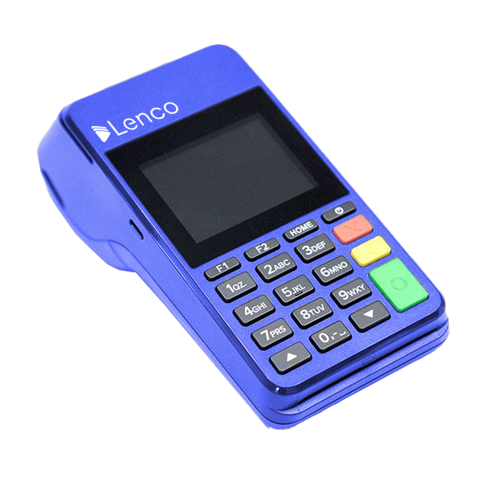

# How do I order a Lenco Terminal (POS)?

Collection: Lenco Terminals (POS)

Original article: [view source](https://support.lenco.co/en/articles/6557774-how-do-i-order-a-lenco-terminal-pos)

Thanks for your interest in ordering our POS.

## Steps To Order A Lenco POS:

**For Nigerian businesses:**

- Kindly log in to the App
  Click on **Terminal**
  Then click **Request Terminal**
  And make your request.

- Please ensure you have enough funds in your Lenco account to be debited for the POS option you want to order.
  (If you don't have a Lenco account, kindly signup [here](https://lenco.co/signup))

Also, send an email to
[ng.pos@lenco.co](mailto:ng.pos@lenco.co)
approving that we can debit your account for the sum of your order
so that we can debit your account and start processing your POS
for delivery.

We ship your POS terminal within 1-2 working days.

**For Zambian businesses:**

- Kindly send an email to [support.zm@lenco.co](mailto:support.zm@lenco.co) to include your phone number, delivery address, and the nature of your business.

- Please ensure you have a Lenco by BroadPay account.

(If you don't have a Lenco by BroadPay account, kindly signup
[here](https://app.lenco.co/signup/business-type?country=ZM))
