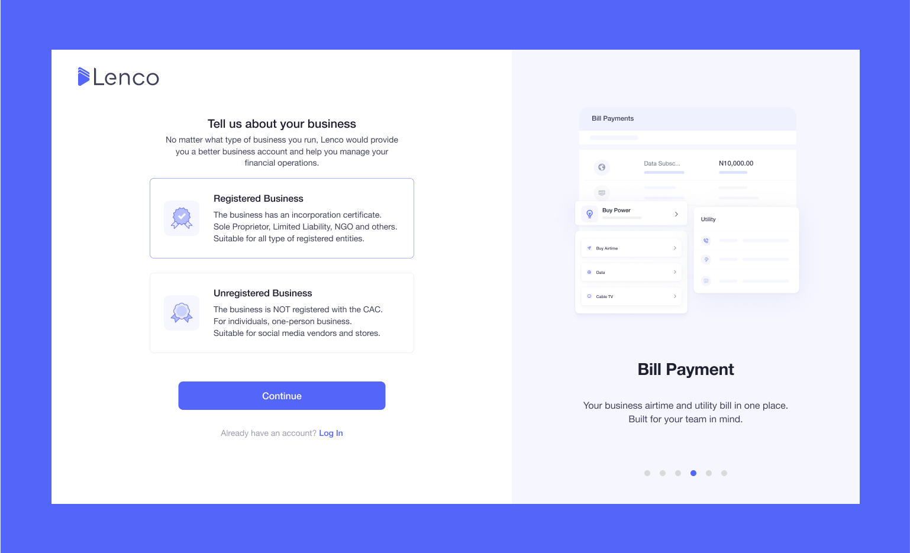
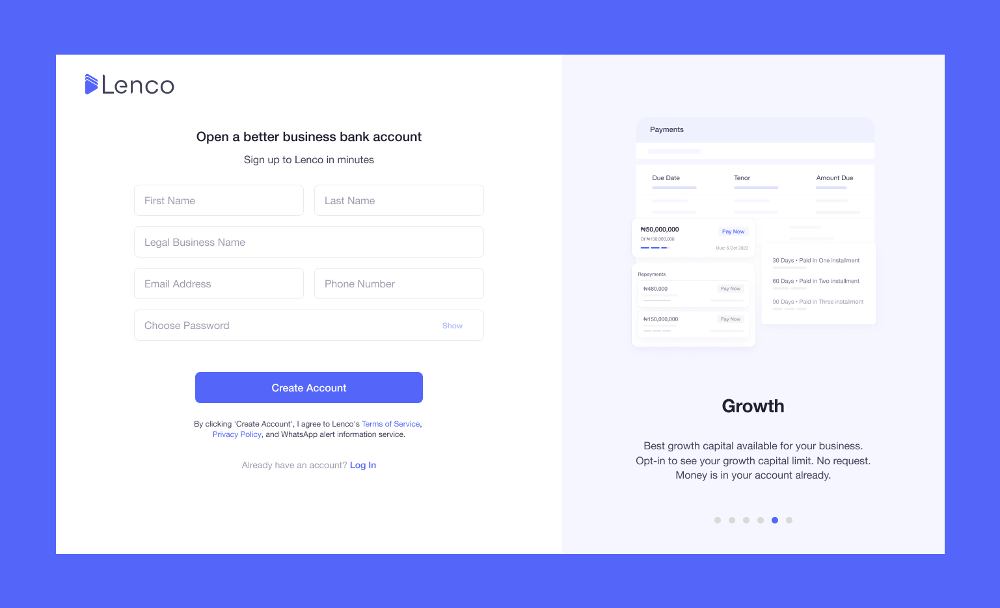
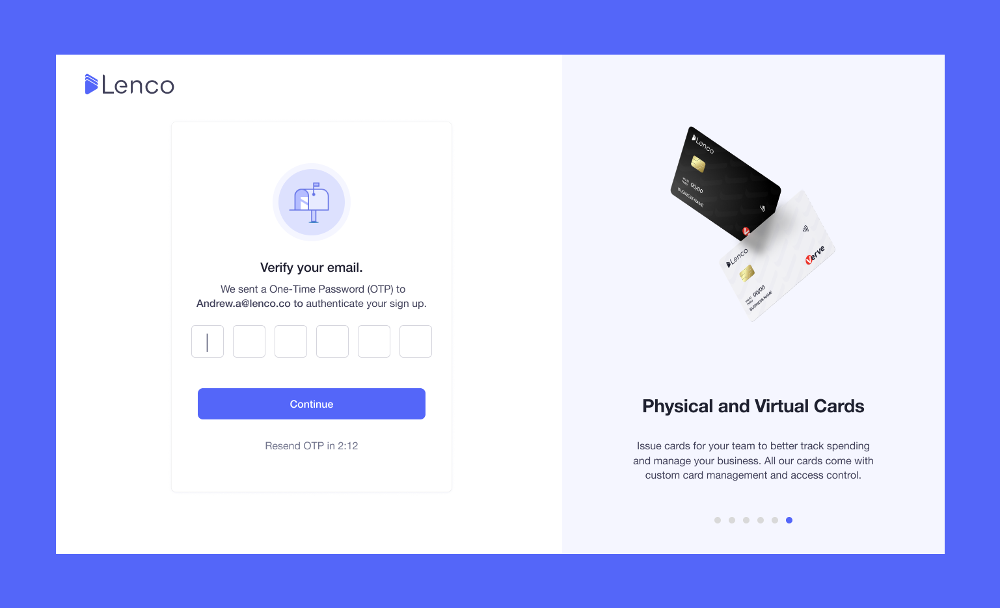
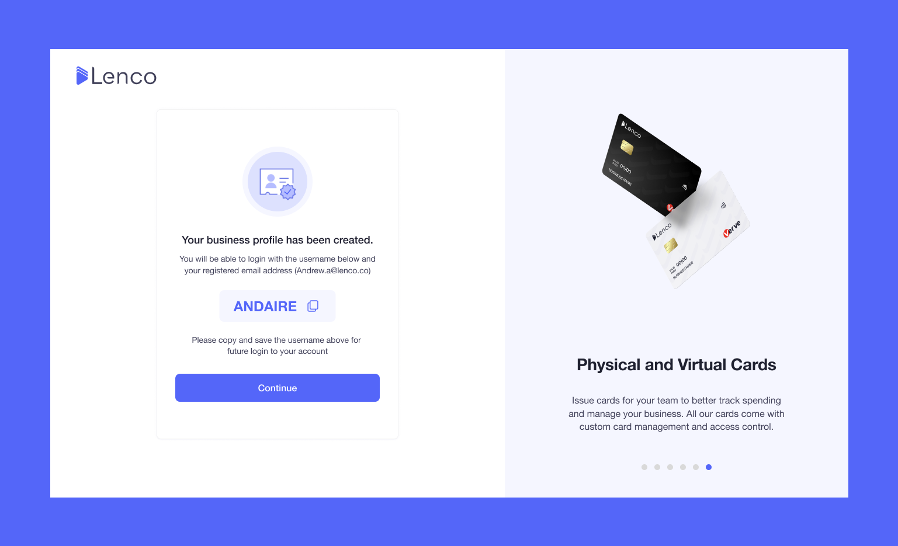

# How can I get a Lenco business account?

Collection: General

Original article: [view source](https://support.lenco.co/en/articles/6573515-how-can-i-get-a-lenco-business-account)

## Nigeria

For your Nigerian business account, kindly complete the following
steps:

- [Signup](https://app.lenco.co/signup).
- Verify your email.
- Fill out the application form and submit the required documents.
- Wait for your application to be reviewed.

Your account application will be approved in 24-48 working hours,
you will be sent an email containing your account number.

See below for a breakdown of how to get a Lenco business account:

## Zambia

For your Zambian business account: Accounts are approved instantly
once all account opening requirements have been provided.
​
