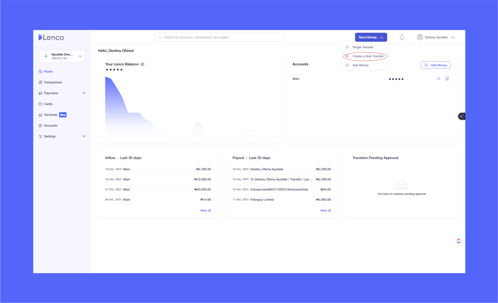
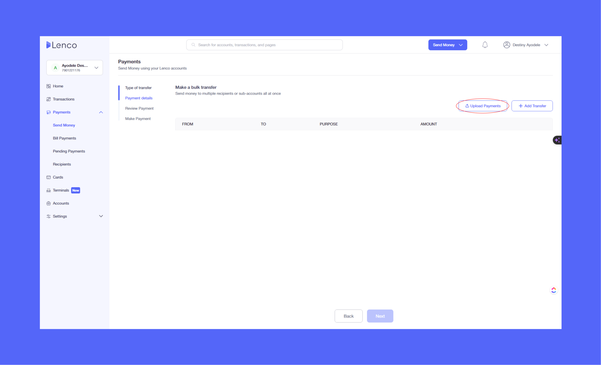
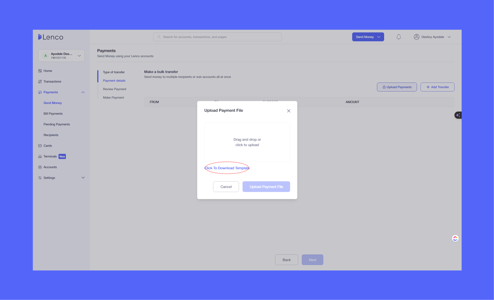

# How can I make bulk payments?

Collection: Making and receiving payments

Original article: [view source](https://support.lenco.co/en/articles/8223847-how-can-i-make-bulk-payments)

To make bulk payment, follow the steps below;

1. Log in via web [https://lenco.co/](https://lenco.co/)
2. Click on **Send Money** on the homepage.
3. Click on **Create a Bulk Transfer.**
4. Click on **Upload Payment.**
5. Click to **Download Template.**
6. Drag and drop or click to upload.

See below for a breakdown of how to make a bulk transfer:

