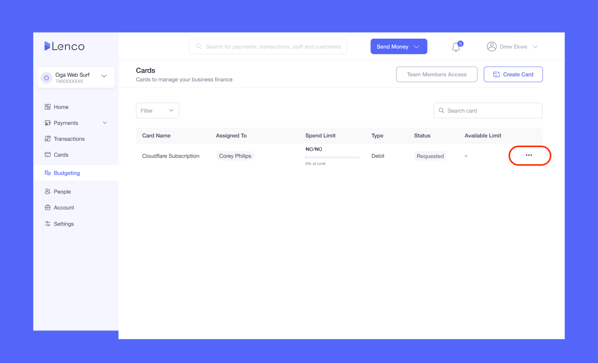
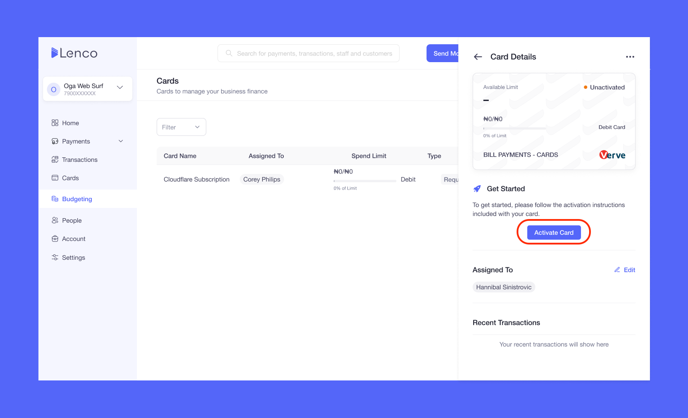
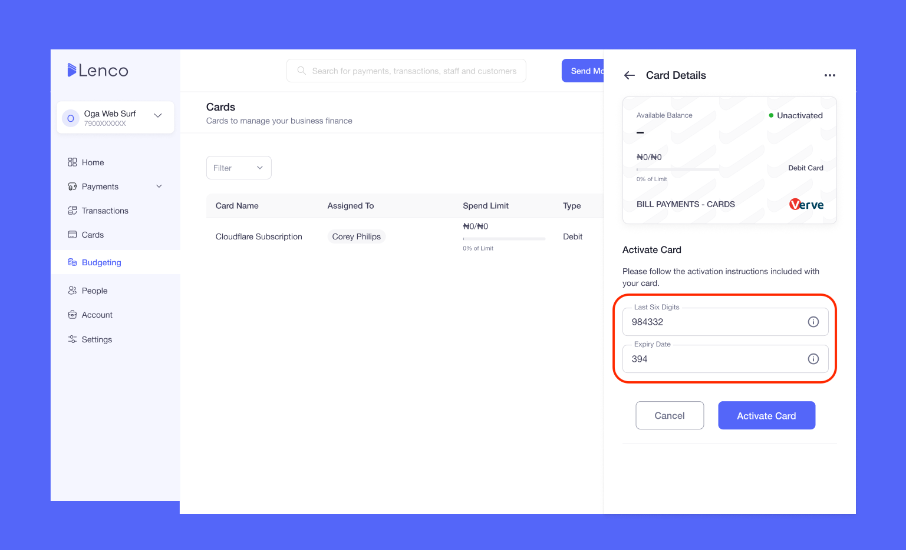
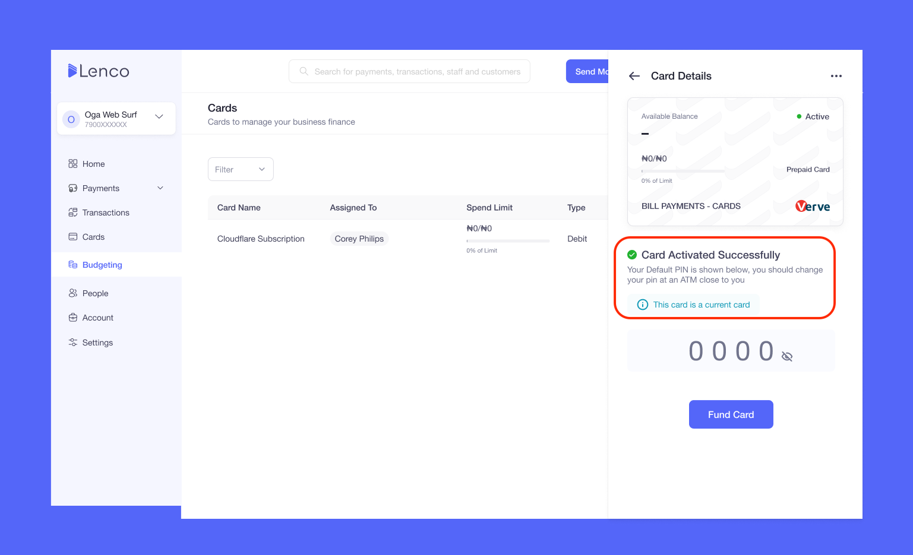

# How can I activate my Lenco card?

Collection: Lenco Cards

Original article: [view source](https://support.lenco.co/en/articles/8587508-how-can-i-activate-my-lenco-card)

To activate your card, kindly follow these steps:

- Log into your Lenco account.
- Click on **Cards**.
- Click on **Activate Card** and follow the instructions.

After activating the card, you will be given a default PIN which
you can change at the nearest ATM. Then, check your account
balance with the new PIN to confirm that your PIN has been
changed.

NB: Where you have team members, only admins can activate the
card.

Kindly see below a breakdown of how to activate your Lenco card.

